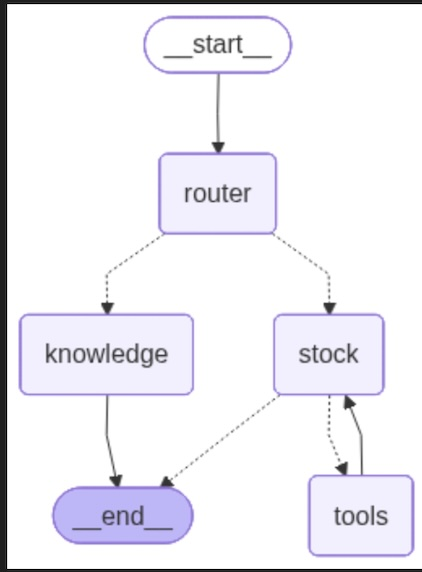
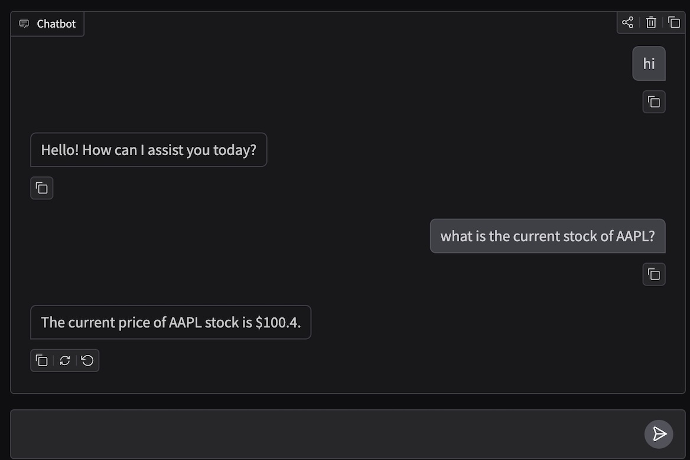
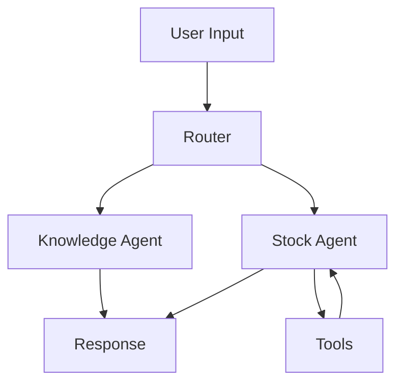

# AI Chatbot System using LangGraph, LangChain, and OpenAI
This project is an end-to-end exploration of **agentic AI systems** built using LangGraph and LangChain, with a strong emphasis on **observability, debugging, and real-world execution challenges** rather than just happy-path demos.

The repository progresses step by step—from a simple chatbot to **tool-augmented, memory-enabled, and Human-in-the-Loop (HITL) agents**—while addressing practical issues related to **environment management, tracing, persistence, and infrastructure**.

All experiments were developed and tested locally and in **GitHub Codespaces**, using **uv** for dependency and Python version management.

---

## 🚀 What This Project Demonstrates

- **State-based agent workflows** using LangGraph
- **Tool calling and agent-style decision-making** (mock & real APIs)
- **Persistent memory and checkpointing using SQLite** (thread-based conversations)
- **Human-in-the-Loop (HITL)** execution with interrupt & resume
- **LangSmith tracing** for observability (LLM calls, tools, latency, cost)
- **Clean Git + Codespaces workflow**, including environment pinning and reproducibility
- **Gradio UI** for interactive experimentation (in notebooks)

---

## 🧩 Project Evolution (Step-by-Step)

1. Simple chatbot
2. Chatbot with tools
3. Agent-style chatbot (tool routing & decision-making)
4. Chatbot with persistent memory (SQLite + thread-based checkpoints)
5. LangSmith tracing & observability
6. Human-in-the-Loop (HITL) workflows
7. HITL fully traced in LangSmith

---

## 🛠️ Technologies Used

- Python
- LangGraph
- LangChain
- LangSmith
- OpenAI (ChatOpenAI)
- SQLite (persistent memory & checkpoints)
- uv (dependency & Python version management)
- GitHub Codespaces
- Gradio (interactive UI)

---

## 📂 Project Structure
```
.
├── notebooks/                       # Jupyter notebooks (step-by-step builds)
├── src/
│   └── langgraph_cb/                # Core package code
├── examples/                        # Runnable demo scripts
├── assets/                          # Images for README
├── data/                            # Local SQLite memory files (ignored)
├── pyproject.toml                   # uv dependency config
├── uv.lock                          # Locked dependencies
├── README.md
└── .gitignore
```

## 📷 Screenshots



## 🗺️ High-Level Flow


---

## 🧑‍💻 Human-in-the-Loop (HITL) Example

The HITL agent pauses execution before performing a sensitive action (e.g., buying stocks):

1. AI proposes an action
2. Execution interrupts
3. Human approves or declines
4. Execution resumes safely

This workflow is fully traced in LangSmith, including:
- Interrupt point
- Human decision
- Resume path
- Final outcome

---

## 🔍 LangSmith Tracing & Debugging

LangSmith is used to trace:
- LangGraph execution flow
- LLM calls
- Tool usage
- Human interruptions & resumes
- Token usage
- Latency and cost

### ⚠️ Key Challenge Faced
LangSmith tracing did not work reliably in the local environment due to:
- DNS-level network restrictions on local Wi-Fi
- Kernel and environment inconsistencies
- Credential and billing mismatches

### ✅ Solution
Execution was moved to GitHub Codespaces, which provided:
- A clean, reproducible environment
- No DNS or firewall restrictions
- Correct credential loading
- Immediate and reliable LangSmith tracing

---

## ▶️ How to Run the Project

### Option 1: GitHub Codespaces (Recommended)

Sync dependencies:
```
uv sync
```
Install the package in editable mode:
```
uv pip install -e .
```
Run the HITL agent:
```
python -m langgraph_cb
```
Or run the demo script:
```
python examples/hitl_demo.py
```

### Option 2: Local Setup

Create a `.env` file:
```
OPENAI_API_KEY=your_openai_key
LANGCHAIN_API_KEY=your_langsmith_key
LANGCHAIN_TRACING_V2=true
LANGCHAIN_PROJECT=langgraph_cb
```

Sync dependencies:
```
uv sync
```

Install the package in editable mode:
```
uv pip install -e .
```

Run:
```
python -m langgraph_cb
```

Note: Local LangSmith tracing may fail due to network or DNS restrictions.

---

## 📘 Key Learnings

- Observability is critical
- Environment and infrastructure matter as much as code
- HITL workflows require memory, checkpointing, and careful control flow
- LangSmith makes invisible agent behavior visible
- Codespaces can resolve real-world tracing blockers

---

## 🚀 Future Improvements

- UI-based Human-in-the-Loop approval
- Automated evaluations in LangSmith
- API deployment

---

## 📌 Final Note

This project was as much about debugging and understanding systems as it was about writing code. It represents a practical, real-world approach to building traceable, controllable, and production-ready AI agents.

### Author
Sandhya Banti Dutta Borah
Built as a hands-on LangGraph + Agent Systems learning project.
